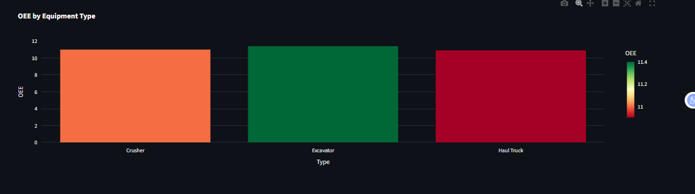
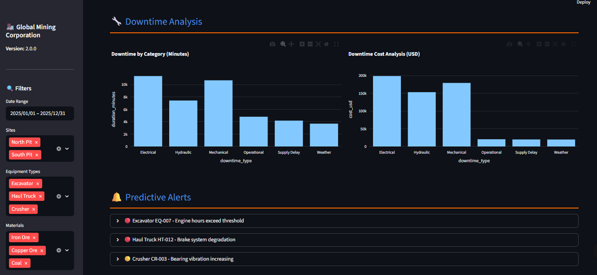

# 🏭 Mining Production Efficiency Dashboard

[](https://www.python.org/)
[](https://streamlit.io/)
[](https://opensource.org/licenses/MIT)
[](CONTRIBUTING.md)

A comprehensive, interactive dashboard for monitoring and optimizing mining production operations through real-time KPIs, predictive analytics, and equipment performance tracking.


## 📋 Table of Contents
- [Features](#-features)
- [Live Demo](#-live-demo)
- [Installation](#-installation)
- [Usage](#-usage)
- [Project Structure](#-project-structure)
- [Key Metrics](#-key-metrics)
- [Visualizations](#-visualizations)
- [Data Sources](#-data-sources)
- [Deployment](#-deployment)
- [Contributing](#-contributing)
- [License](#-license)
- [Contact](#-contact)

## 🎯 Features

### 📊 **Real-time Monitoring**
- **Overall Equipment Effectiveness (OEE)** tracking with industry benchmarks
- **Production Volume** monitoring (daily, monthly, yearly trends)
- **Equipment Utilization** rates and status tracking
- **Downtime Analysis** with root cause categorization
- **Cost per Ton** calculations for financial optimization

### 🔍 **Advanced Analytics**
- **Predictive Maintenance** alerts for proactive equipment management
- **Quality Analysis** by material type and equipment
- **Shift Performance** comparison (Day vs Night operations)
- **Site-wise Production** analysis across multiple mining pits

### 📱 **User Experience**
- **Interactive Filters** for date ranges, equipment types, materials, and sites
- **Responsive Design** for desktop and tablet viewing
- **Dark/Light Mode** compatible visualizations
- **Export Functionality** for reports in Excel format
- **Real-time Data Refresh** with caching optimization

## 🚀 Live Demo

Try the dashboard online: [Mining Dashboard Demo](https://mining-dashboard.streamlit.app/) *(Coming Soon)*

## 🛠️ Installation

### Prerequisites
- Python 3.9 or higher
- pip package manager

### Step-by-Step Setup

1. **Clone the repository**
```bash
git clone https://github.com/yourusername/mining-production-dashboard.git
cd mining-production-dashboard
```

2. **Create virtual environment**
```bash
# Windows
python -m venv venv
venv\Scripts\activate

# Mac/Linux
python3 -m venv venv
source venv/bin/activate
```

3. **Install dependencies**
```bash
pip install -r requirements.txt
```

4. **Run the application**
```bash
streamlit run app.py
```

5. **Open your browser**
Navigate to `http://localhost:8501`

## 📖 Usage

### 1. **Dashboard Navigation**
- **Sidebar Filters**: Adjust date ranges, select sites, equipment types, and materials
- **Main Dashboard**: View key metrics and production trends
- **Equipment Monitoring**: Track equipment status and performance
- **Downtime Analysis**: Analyze equipment failures and maintenance patterns
- **Predictive Alerts**: View maintenance recommendations

### 2. **Data Exploration**
- **Date Range Selection**: Analyze specific periods from January to December 2025
- **Site Filtering**: Compare performance across different mining pits
- **Equipment Filtering**: Focus on specific equipment categories
- **Material Analysis**: Track different ore types and waste materials

### 3. **Export Options**
- **Excel Reports**: Download filtered data for offline analysis
- **PDF Reports**: Generate comprehensive performance summaries
- **Real-time Updates**: Refresh data with single click

## 📁 Project Structure

```
mining-production-dashboard/
├── app.py                    # Main Streamlit application
├── requirements.txt          # Python dependencies
├── README.md                # Project documentation
├── LICENSE                  # MIT License
├── .gitignore              # Git ignore file
├── assets/                 # Images and screenshots
│   ├── dashboard-preview.png
│   ├── equipment-monitoring.png
│   └── oee-analysis.png
└── docs/                   # Additional documentation
    ├── installation.md
    └── api_reference.md
```

## 📊 Key Metrics

### **Overall Equipment Effectiveness (OEE)**
```
OEE = Availability × Performance × Quality × 100%
```
- **Availability**: (Planned Time - Downtime) / Planned Time
- **Performance**: Actual Output / Expected Output
- **Quality**: Good Output / Total Output

### **Production Metrics**
- **Total Production**: Sum of all material moved (tons)
- **Daily Average**: Production rate per operating day
- **Material Distribution**: Percentage of ore vs waste
- **Quality Grade**: High/Medium/Low classifications

### **Equipment Metrics**
- **Utilization Rate**: Active equipment / Total equipment
- **Status Distribution**: Operational vs Maintenance vs Idle
- **OEE by Equipment Type**: Performance comparison across categories
- **Downtime Analysis**: Failure frequency and duration

### **Financial Metrics**
- **Cost per Ton**: Total operational cost / Total production
- **Downtime Cost**: Financial impact of equipment failures
- **Operational Efficiency**: Revenue per equipment hour

## 📈 Visualizations

### 1. **Production Trends**

*Daily production volume with trend lines and anomaly detection*

### 2. **Equipment Monitoring**

*Real-time equipment status with color-coded indicators*

### 3. **OEE Analysis**

*Overall Equipment Effectiveness by equipment type and site*

### 4. **Downtime Pareto**

*Downtime categorization with cost impact analysis*

## 🗃️ Data Sources

### **Current Implementation**
The dashboard uses **synthetic data generation** that simulates:
- 30 mining equipment units (Excavators, Haul Trucks, Crushers, etc.)
- Full year 2025 production data with realistic patterns
- Equipment specifications from CAT, Komatsu, Hitachi
- Mining industry operational patterns

### **Real Data Integration**
Ready to connect to:
- **SCADA Systems** (real-time equipment sensors)
- **ERP Databases** (SAP, Oracle Mining)
- **Fleet Management Systems** (Komatsu, Caterpillar)
- **Manual Data Entry** (Excel, CSV imports)

## 🌐 Deployment

### **Option 1: Streamlit Cloud (Free)**
1. Push code to GitHub repository
2. Visit [share.streamlit.io](https://share.streamlit.io)
3. Connect your repository
4. Deploy with one click

### **Option 2: Docker Deployment**
```dockerfile
FROM python:3.9-slim
WORKDIR /app
COPY requirements.txt .
RUN pip install -r requirements.txt
COPY . .
EXPOSE 8501
CMD ["streamlit", "run", "app.py", "--server.port=8501", "--server.address=0.0.0.0"]
```

### **Option 3: AWS/GCP/Azure**
- **AWS**: EC2 with Load Balancer + RDS
- **GCP**: App Engine + Cloud SQL
- **Azure**: App Service + Azure SQL

## 🤝 Contributing

We welcome contributions! Please see our [Contributing Guidelines](CONTRIBUTING.md).

### **Development Setup**
```bash
# Fork and clone the repository
git clone https://github.com/yourusername/mining-production-dashboard.git

# Create feature branch
git checkout -b feature/amazing-feature

# Install development dependencies
pip install -r requirements-dev.txt

# Make your changes and test
streamlit run app.py

# Commit and push
git commit -m "Add amazing feature"
git push origin feature/amazing-feature

# Create Pull Request
```

### **Areas for Contribution**
- Add real database connectors
- Implement machine learning predictions
- Create mobile-responsive designs
- Add multi-language support
- Develop API endpoints
- Write unit tests

## 📄 License

This project is licensed under the MIT License - see the [LICENSE](LICENSE) file for details.

```
MIT License

Copyright (c) 2024 [Your Name]

Permission is hereby granted, free of charge, to any person obtaining a copy
of this software and associated documentation files (the "Software"), to deal
in the Software without restriction, including without limitation the rights
to use, copy, modify, merge, publish, distribute, sublicense, and/or sell
copies of the Software, and to permit persons to whom the Software is
furnished to do so, subject to the following conditions:

The above copyright notice and this permission notice shall be included in all
copies or substantial portions of the Software.
```

## 📞 Contact

**Your Name** - [@yourtwitter](https://twitter.com/yourtwitter) - email@example.com

**Project Link**: [https://github.com/yourusername/mining-production-dashboard](https://github.com/yourusername/mining-production-dashboard)

**LinkedIn**: [Your Profile](https://linkedin.com/in/yourprofile)

---

## 🙏 Acknowledgments

- Mining industry standards from MSHA and NIOSH
- Equipment specifications from Caterpillar, Komatsu, Hitachi
- Streamlit community for excellent documentation
- Open-source data visualization libraries
- Safety and efficiency guidelines from mining associations

---

<div align="center">
  
Made with ❤️ for the mining industry

[⭐ Star this repo](https://github.com/yourusername/mining-production-dashboard/stargazers) |
[🐛 Report Bug](https://github.com/yourusername/mining-production-dashboard/issues) |
[💡 Request Feature](https://github.com/yourusername/mining-production-dashboard/issues)

</div>
```

---
